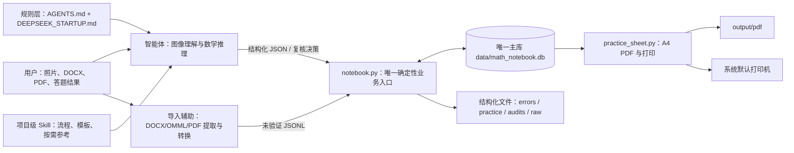
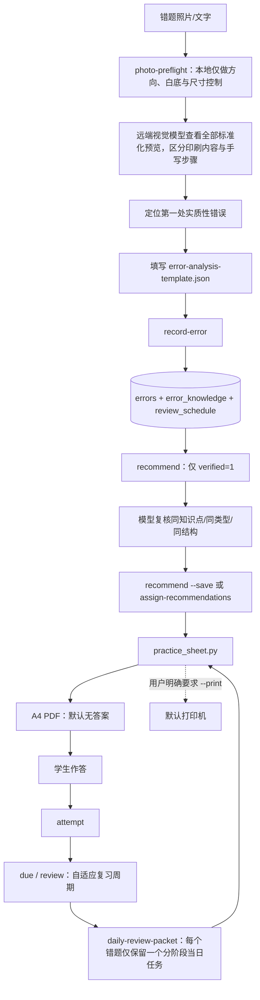
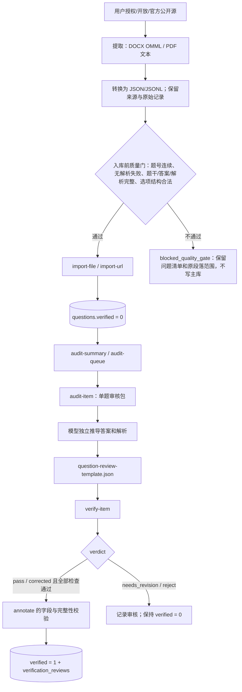
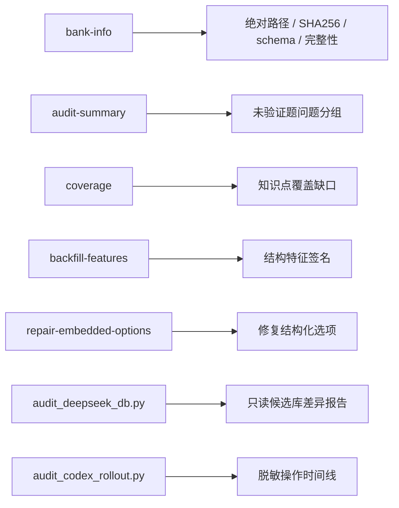

# 李兆霖数学错题本：完整项目架构与功能索引

本文件是智能体的“先查后建”索引。修改或新建功能前，先在这里确认是否已有命令、脚本、数据表或工作流。项目规则以 `AGENTS.md` 和项目级 Skill 为准；本文件解释现有实现，不放宽任何质量规则。

## 1. 当前系统快照

- 正式项目名称：`李兆霖数学错题本`
- 唯一活动题库：`data/math_notebook.db`
- 数据库 schema：`2`
- 题目：`7766`；已验证：`7766`；未验证：`0`
- 错题记录：`25`；到期复习阶段：`110`
- 主执行器：`.agents/skills/math-error-notebook/scripts/notebook.py`
- 组卷与打印：`.agents/skills/math-error-notebook/scripts/practice_sheet.py`
- 照片视觉预检：`notebook.py photo-preflight`（只做 EXIF 方向、透明底白底化、尺寸压缩与缓存，远端视觉模型直接看全部预览）
- 默认打印机：`EPSON72097C (L3250 Series)`

数量是 2026-08-08 的实施前快照；实际状态以 `bank-info --json` 为准。

## 2. 总体架构



职责边界：智能体负责识别题目、定位首个错误、独立数学推导和相关性复核；脚本负责校验格式、数据库事务、去重、状态更新、检索、组卷和打印。不得用脚本伪造数学审核，也不得让模型直接改数据库。

## 3. 三条核心业务链

### 3.1 照片批改、推荐、打印与复习



### 3.2 授权题目导入与逐题验证

`2026-07-19-g11-beijing-20`，以及自 `2026-07-20`（含）起入库的高质量试卷题，是用户确认的简化验证范围：可免每题完整独立重解，仍须逐题检查完整性、重复项、答案解析自洽、标签与来源，并通过 `audit-item → verify-item`；发现疑点时恢复独立推导。`audit-summary` 给出当前可简化数量，`audit-queue/prepare-audit-batch --simplified-only` 直接筛选。更早的其他来源继续执行下图中的完整独立推导流程。



### 3.3 题库维护与审计



## 4. 权威入口与优先级

| 优先级 | 入口 | 用途 | 是否可写主库 |
|---|---|---|---|
| 1 | `.agents/.../scripts/notebook.py` | 全部常规业务、导入、审核、推荐和学习状态 | 是，受校验约束 |
| 2 | `.agents/.../scripts/practice_sheet.py` | 从已保存推荐生成 PDF 并打印 | 否，仅输出文件/打印 |
| 3 | `scripts/extract_docx_omml.py` + `build_omml_exam_import.py` | DOCX/OMML 提取和未验证导入文件构建 | 否 |
| 3 | `scripts/extract_pdf_text.py` | PDF 原文审核辅助 | 否 |
| 4 | 其他 `scripts/*.py` | 历史批次、取证或专项迁移 | 除明确调用 `notebook.py` 外不得写库 |

新智能体不得创建第二套数据库访问层、推荐器、PDF生成器或验证器。可复用功能应扩展权威入口，并补充 `tests/test_notebook.py`。

Skill 只有一个安装包：`.agents/skills/math-error-notebook`。Codex CLI 模型任务统一通过包内 `scripts/codex_task_router.py` 在 Luna、Terra 和 Sol 之间路由；安装版按
`LIZHAOLIN_MATH_NOTEBOOK_ROOT`、当前目录向上的主库/项目标记、当前目录的顺序绑定项目；绑定后仍只使用该项目的 `data/math_notebook.db`，不会跨磁盘发现题库。

## 5. `notebook.py` 全部 CLI 功能

所有命令默认使用唯一主库。`--json` 返回精简 JSON；仅在确有需要时使用 `--full` 或 `--pretty-json`。

| 功能域 | 命令 | 已有能力 |
|---|---|---|
| 智能体启动 | `doctor` | 一次检查唯一主库、schema、完整性、项目文件、PDF 依赖、LibreOffice 和打印配置 |
| 智能体启动 | `agent-context` | 按 grade/recommend/verify/import/review/pdf/maintenance 返回最小规则与命令集合 |
| 智能体交接 | `handoff` | 精简输出主库哈希、验证数量、主要问题、复习任务和 Git 状态 |
| 行为标准 | `behavior-cases` | 按任务列出跨模型标准案例；只在需要时加载单个完整案例 |
| 可恢复流程 | `workflow-start` / `workflow-update` / `workflow-status` | 在 `data/workflows/` 保存步骤、产物和断点，不重复已完成阶段 |
| 照片预检 | `photo-preflight` | 仅做 EXIF 方向、透明底白底化、JPEG 编码、尺寸控制和内容哈希缓存；精简返回全部 `preview_paths` 与 `review_route=remote_model_visual_review`，由远端视觉模型逐页查看 |
| 初始化 | `init` | 创建 schema、装载知识点；主库存在时不得用来重建数据 |
| 初始化 | `seed` | 幂等导入项目原创种子题，仅用于首次建库 |
| 题库身份 | `bank-info` | 主库绝对路径、SHA256、schema、完整性、外键和数量 |
| 文件导入 | `import-file` | 导入授权 JSON、JSONL、CSV；外部题默认未验证 |
| URL导入 | `import-url` | 下载授权结构化数据并保存原始快照 |
| 来源登记 | `register-exam-dir` | 登记本地 PDF 试卷目录并生成来源清单 |
| 来源同步 | `sync-source-manifest` | 将来源清单同步到题库来源记录 |
| 来源修复 | `update-source` | 修正一个来源的 URL、许可、授权确认和备注 |
| 来源查询 | `sources` | 精简列出来源及题目/已验证数量，供批量导入幂等判断 |
| 错题保存 | `record-error` | 保存结构化错因、图片、知识点和复习周期 |
| 错题预检/保存 | `grade-preview` / `grade-commit` | 写库前验证错因 JSON；粗心必须有直接证据；提交复用同一质量门 |
| 错题撤销 | `delete-error` | 删除误保存的错题及受控派生文件；有历史作答时须显式 `--detach-attempts`，保留作答但解除错题关联 |
| 推荐预览/保存 | `recommend` | 按知识点、错因、难度、作答史、自动/显式判别词和细粒度考法特征排序已验证题；`--mode auto` 按复习阶段选择同难度、变式或迁移目标 |
| 推荐审核包 | `recommend-packet` | 两阶段本地召回与排序，过滤近重复、明显乱码、语言错配和不完整选择题，默认写入不含答案/长解析的精简审核包；同一审核包复核后可直接交给 `assign-recommendations` |
| 推荐评测 | `recommend-eval` | 对人工复核的 `math-recommendation-eval/v1` 案例和候选包计算 Hit@3、Recall@K；只读、不改主库 |
| 人工推荐 | `assign-recommendations` | 用模型逐题复核后的已验证题替换自动候选 |
| 复习到期 | `due` | 每个活动错题只返回一个当前可执行阶段；逾期按天数显示，不累计后续阶段任务 |
| 每日复习包 | `daily-review-packet` | 每个活动错题只暴露一个当前可执行阶段；阶段1–2带2道同难度推荐，阶段3–4带1道变式，阶段5–6带1道优先略难迁移题；只使用已复核且已验证题 |
| 复习反馈 | `review` | 记录 correct/partial/wrong，并在失败时启动新周期 |
| 掌握确认 | `master-error` | 用户明确确认已掌握时，保留已完成复习历史并取消尚未发生的后续阶段 |
| 复习更正 | `correct-review` | 原位更正最近一次误判，并恢复或重建对应复习周期；不重复推进阶段 |
| 作答记录 | `attempt` | 保存推荐题对错、答案和新的错因 |
| 作答更正 | `correct-attempt` | 原位更正误判的 attempt，并同步推荐状态；不重复计数 |
| 作答撤销 | `delete-attempt` | 删除“实际未作答”却被误记的 attempt，并恢复该推荐题的最近历史状态或待作答状态 |
| 推荐暂缓/恢复 | `recommendation-status` | 将未学内容保留在推荐历史中并标为 `deferred`，每日复习不入卷；学完后恢复为 `assigned` |
| 检索 | `search` | 按知识点、年级、难度、文本、验证状态精简检索；适合的文本查询自动使用主库内 FTS5 |
| 检索维护 | `rebuild-search-index` | 先备份唯一主库，再在同一 SQLite 内重建 FTS5 trigram 索引与同步触发器 |
| 单题详情 | `question` | 按 ID 读取题目；照片判题优先用 `--compact` 省略长解析和非必要元数据，确有需要才读完整题目；`--raw` 才读取原始导入记录 |
| 代码查询 | `knowledge` | 精简查询知识点代码 |
| 代码查询 | `causes` | 精简查询错因代码 |
| 代码查询 | `features` | 精简查询题目结构特征代码 |
| 单题标注 | `annotate` | 修正题干/答案/解析/标签/难度/题型；内部验证质量门 |
| 审核队列 | `audit-queue` | 精简列出未验证题，可按来源过滤；`--simplified-only` 只列自 2026-07-20 起入库的简化验证题 |
| 审核包 | `audit-item` | 汇总一题的内容、来源、问题、近重复项、审核要求和 `verification_mode` |
| 审核脚手架 | `prepare-audit-batch` | 生成逐题审核包和 verdict=pending 的审核 JSON，不修改数据库；支持 `--simplified-only`；`--visual-evidence auto` 只对含图题生成远端视觉用标准预览，文本题零视觉开销；透明 PNG 仅在审核工作目录生成白底预览，`off` 禁用视觉证据 |
| 精简审核扩展 | `prepare-review-batch` | 将模型逐题给出的精简决策扩展为完整审核 JSON，不替代数学判断、不写库 |
| 结构化验证 | `verify-item` | 接受独立审核 JSON；逐题记录并在通过时提升状态 |
| 批量提交审核 | `verify-review-batch` | 逐项复用 `verify-item` 质量门提交审核文件，只压缩命令输出，不批量放宽验证 |
| 特征回填 | `backfill-features` | 幂等推断题型结构特征，不改变验证状态 |
| 选项修复 | `repair-embedded-options` | 从原始记录或题干回填 A-D 结构化选项 |
| 审核汇总 | `audit-summary` | 按来源统计缺解析、异常公式、占位答案、图形依赖，并返回简化/完整验证题量 |
| 学习统计 | `stats` | 错题、推荐、正确率、薄弱知识点和错因统计 |
| 课程覆盖 | `coverage` | 按课程知识点统计已验证题覆盖 |

### 内部函数分组

不要重新实现这些内部能力；需要变更时直接修改现有函数并补测试。

- 数据库与标识：`default_database_path`、`connect`、`init_database`、`fingerprint`、`slug_id`、`bank_info`
- 题目标准化：`infer_knowledge`、`infer_question_features`、`validate_feature_codes`、`normalize_difficulty`、`normalize_question`、`insert_question`
- 导入与来源：`import_records`、`read_json_records`、`fetch_json`、`register_exam_directory`、`sync_source_manifest`、`update_source_metadata`、`list_sources`
- 错题与复习：`create_review_cycle`、`render_error_markdown`、`validate_error_analysis`、`record_error`、`fetch_error`、`delete_error`、`review_due`、`daily_review_packet`、`mark_review`、`correct_review`、`record_attempt`、`correct_attempt`、`delete_attempt`、`set_recommendation_status`
- 推荐：`automatic_recommendation_keywords`、`recommendation_candidate_is_usable`、`resolve_recommendation_mode`、`compact_recommendations`、`question_feature_codes`、`backfill_question_features`、`error_feature_codes`、`recommend`、`recommendation_packet`、`evaluate_recommendation_packets`、`assign_recommendations`
- 检索与统计：`stats`、`coverage`、`list_knowledge_points`、`list_cause_codes`、`list_feature_codes`、`question_detail`、`search_questions`、`search_index_status`、`rebuild_search_index`
- 审核与修复：`annotate_question`、`question_issue_codes`、`near_duplicate_candidates`、`audit_item`、`prepare_audit_batch`、`prepare_verification_reviews`、`apply_verification_review`、`apply_verification_review_batch`、`repair_embedded_options`、`audit_queue`、`audit_summary`
- 启动与交接：`doctor`、`agent_context`、`handoff_snapshot`、`behavior_cases`、`workflow_start/update/status`、`_git_summary`
- 照片视觉输入：`photo_preflight.py` 中的 `prepare_photo_previews` 只生成方向正确、白底、尺寸受控且可缓存的远端视觉输入，不识别、不解题、不判题

### 照片预处理

- 预处理只依赖 Pillow，不需要独立模型运行时、共享锁或 GPU。
- `photo-preflight.json` 记录输入哈希、预览路径与尺寸；相同输入和参数直接命中缓存。
- 标准化预览必须由具备视觉能力的远端模型逐页查看；文本模型必须交接，不得依据路径或历史文本猜测。
- CLI：`print_output`、`build_parser`、`main`

## 6. `practice_sheet.py` 完整职责

调用形式：

```powershell
python -B .agents\skills\math-error-notebook\scripts\practice_sheet.py <error-id>
python -B .agents\skills\math-error-notebook\scripts\practice_sheet.py --daily-packet <packet.json>
python -B .agents\skills\math-error-notebook\scripts\practice_sheet.py --exam-packet <packet.json>
```

已有能力：读取错题及已保存推荐、每日复习包，或由已验证题号组成的 `math-exam-packet/v1` 正式试卷包；默认生成无答案 A4 练习卷/考试卷，按需增加答案页，并在用户明确要求时通过 LibreOffice/系统打印接口发送到配置的打印机。每日复习 PDF 使用固定分组排版：主序号按错题递增，每组先显示错题编号与错题回顾，组内推荐固定显示为“同类型推荐题 1/2”并附题库编号、难度、推荐理由和来源；推荐题不另占主序号。正式试卷包校验分区、题号去重、逐题正分、总分一致和 `verified=1`，支持仅用于等义排版修正的 `display_stem`。数学公式支持 `$...$`、`$$...$$`、`\\(...\\)` 与 `\\[...\\]`，通过项目级 `requirements-pdf.txt` 固定依赖并安装到忽略版本控制的 `runtime/pdf`；独立数学变量 `l` 在渲染前统一规范为清晰的 `\\ell`，避免与斜杠混淆；题图会自动裁除近白边、按 DPI 计算物理尺寸、限制在 110×65 mm 内且不放大小图。

内部函数：`bundled_python`、`missing_pdf_modules`、`ensure_pdf_runtime`、`load_config`、`load_items`、`clean_math`、`_normalize_line_symbol`、`_normalize_render_latex`、`truncate_clean_text`、`prepare_diagram_image`、`paragraph_text`、`find_soffice`、`print_pdf`、`create_pdf`、`parse_args`、`main`。

不要为普通推荐题另建 PDF 脚本；应扩展本脚本。

## 7. 根目录辅助脚本清单

| 脚本 | 类型 | 作用 | 新任务使用规则 |
|---|---|---|---|
| `scripts/extract_docx_omml.py` | 通用、只读提取 | 直接读取 OOXML，将微软 OMML 公式转为 LaTeX；保留旧式 MathType/OLE 的 VML 预览图；导出段落 JSON/Markdown/媒体 | DOCX 精确公式提取首选；OLE 预览仍须远端视觉复核 |
| `scripts/docx_parsing.py` | 通用解析库 | 清理 OMML 转换后的 LaTeX，并拆分混合格式选项且保留同行题干 | 由通用构建器和历史专项脚本共同复用，禁止再从专项脚本导入通用能力 |
| `scripts/build_omml_exam_import.py` | 通用批次转换 | 兼容常见题号/选项标记，分题并保留原段落范围，配对答案/真实解析，输出未验证 JSONL 与缺题、重号、解析失败等质量报告 | 与上一脚本配套；质量门通过后才可导入，导入后仍逐题验证 |
| `scripts/import_recent_docx_batch.py` | 日期批次编排 | 去重后调用 OMML 提取与构建，并在 `import-file` 前检查题号连续性、解析失败、字段完整性和选项结构 | 任一异常标记 `blocked_quality_gate` 并停止该卷入库；不得绕过 |
| `scripts/audit_recent_docx_batch.py` | 入库后结构审核 | 构建逐题审核包，检查字段、标签、来源和题干/答案/解析/选项中的全部图片引用 | 图形依赖题必须转视觉复核，不得直接走纯文本简化通过 |
| `scripts/docx_extractor.py` | 实验性一体提取 | 基于 python-docx/lxml 解析 OMML、题目、答案和解析，支持预览/JSONL | 与前两者能力重叠；未完成统一代码映射，未经回归测试不要作为主流程 |
| `scripts/_test_extract.py` | 临时烟雾测试 | 预览 `docx_extractor.py` 前 5 题 | 不是生产入口 |
| `scripts/extract_pdf_text.py` | 通用、只读 | 使用 pypdf 提取分页文本供源文件审核 | 文本型 PDF 使用；扫描 PDF 仍需远端视觉复核 |
| `scripts/audit_deepseek_db.py` | 历史取证、只读 | 比较候选库与唯一主库，输出插入/删除/字段差异及近似题 | 只生成报告，禁止据此自动合库 |
| `.agents/.../scripts/codex_task_router.py` + `assets/codex-model-routing.json` + `assets/codex-schemas/` | Codex CLI 只读模型路由 | 按任务和显式风险在 Luna、Terra、Sol 之间选择；本地压缩输入，经 JSON Schema 输出，低置信度最多升级一次并记录无正文审计 | 随唯一 Skill 安装；不写数据库；判题、审核和推荐结果仍须经过 `grade-preview`、`prepare-review-batch`、`assign-recommendations` 等现有质量门；详见 `MODEL_ROUTING.md` |
| `scripts/audit_codex_rollout.py` | 历史取证、只读 | 将 Codex rollout JSONL 脱敏并生成可审核时间线 | 仅在有操作日志文件时使用 |
| `scripts/build_db_correction_map.py` | 专项迁移、只读 | 将重新提取的来源题映射到题库内部 ID | 只产出 correction JSON，不直接改库 |
| `scripts/apply_question_reviews.py` | 旧版批次验证器 | 逐条调用 `annotate --verify` 应用历史审核 manifest | 新审核改用 `audit-item` + `verify-item`；不得用于批量自动验证 |
| `scripts/build_dongzhimen_review.py` | 东直门专项 | 生成该 21 题的更正载荷和审核记录 | 不用于其他试卷 |
| `scripts/extract_dongzhimen.py` | 东直门旧流程 | 从特定文本布局切分该试卷 | 已被 OMML 流程替代，不泛化 |
| `scripts/convert_dongzhimen.py` | 东直门旧流程 | 将该试卷旧提取结果转换为导入 JSONL | 不泛化 |
| `scripts/generate_q6_targeted_practice_pdf.py` | 第六题专项 | 生成一次性的圆心/切线专题 PDF | 普通推荐打印改用 `practice_sheet.py` |

## 8. Skill 资源

| 路径 | 内容 | 何时读取/使用 |
|---|---|---|
| `.agents/.../SKILL.md` | 核心流程和不变量 | 每个错题本任务都读 |
| `agents/openai.yaml` | Skill 显示名、默认提示和隐式触发配置 | Codex 发现 Skill 时使用 |
| `assets/error-analysis-template.json` | 错题结构化保存模板 | 照片/文字批改 |
| `assets/question-review-template.json` | 单题独立验证模板 | `audit-item` 后、`verify-item` 前 |
| `assets/model-behavior-cases.json` | 跨模型判题、审核、推荐边界案例 | 新接入模型按任务列出，疑难时只读取单例 |
| `assets/knowledge-points.json` | 高中数学知识点代码表 | 初始化和代码查询 |
| `assets/seed-questions.jsonl` | 项目原创已验证种子题 | 仅首次建库 |
| `references/error-taxonomy.md` | 错因定义和判定边界 | 错因不明确时按需读 |
| `references/data-contract.md` | 错题和题目 JSON 契约 | 模板校验失败或构建导入时读 |
| `references/import-and-verification.md` | 授权导入和两阶段验证 | 仅导入/验证任务读 |

## 9. 数据库关系


数据库共有 13 张业务/元数据表：`metadata`、`sources`、`knowledge_points`、`questions`、`question_knowledge`、`question_targets`、`question_features`、`verification_reviews`、`errors`、`error_knowledge`、`review_schedule`、`recommendations`、`attempts`。此外可在同一主库内建立 `questions_fts` 及其 FTS5 内部表和同步触发器；这些是可重建检索索引，不是第二套题库。

## 10. 文件与目录所有权

```text
math-error-notebook/
├─ AGENTS.md                         项目硬规则
├─ DEEPSEEK_STARTUP.md               外部模型启动交接
├─ PROJECT_ARCHITECTURE.md           本文件：先查后建索引
├─ .editorconfig / .gitattributes    UTF-8、换行和二进制文件规则
├─ .codex/rules.md                    旧版 Codex 兼容提示；不替代 AGENTS.md
├─ .agents/skills/math-error-notebook/
│  ├─ SKILL.md                       智能体工作流
│  ├─ agents/openai.yaml             Codex Skill 列表元数据
│  ├─ scripts/notebook.py            唯一业务/数据库入口
│  ├─ scripts/codex_task_router.py   Codex CLI Luna/Terra/Sol 路由入口
│  ├─ scripts/math_notebook_project_paths.py  项目级/已安装 Skill 的根目录解析器
│  ├─ scripts/practice_sheet.py      PDF与打印入口
│  ├─ scripts/requirements-pdf.txt   安装版 PDF 固定依赖
│  ├─ assets/                        JSON模板、代码表、种子题
│  └─ references/                    按需读取的详细规范
├─ data/
│  ├─ math_notebook.db               唯一活动题库
│  ├─ raw/                           原始结构化导入快照
│  ├─ imports/                       试卷提取与批次中间物
│  ├─ audits/                        审核包、审核结果和历史审计
│  ├─ images/                        错题原图副本
│  ├─ backups/                       受控数据库备份，不是活动库
│  └─ workflows/                     可恢复任务清单（步骤、产物、断点）
├─ errors/YYYY-MM/                   可读错题报告
├─ practice/                         推荐练习 Markdown
├─ output/pdf/                       A4打印版 PDF
├─ config/math-error-notebook.json   打印配置
├─ scripts/                          导入、取证、迁移和专项工具
└─ tests/test_notebook.py            核心功能回归测试
```

## 11. 防止重复造功能的决策表

| 想做的事情 | 先使用 | 不要新建 |
|---|---|---|
| 保存错题 | `record-error` | 第二套错题 JSON/数据库 |
| 检索题目 | `search`、`question` | 全库扫描脚本 |
| 推荐同类题 | `recommend`、`assign-recommendations` | 新推荐器或直接 SQL |
| 输出/打印练习或正式试卷 | `practice_sheet.py`（正式试卷用 `--exam-packet`） | 新通用 PDF 生成器 |
| 导入 JSON/CSV | `import-file` | 新数据库导入器 |
| 导入 DOCX | `extract_docx_omml.py` + `build_omml_exam_import.py` + 入库前质量门 + `import-file`；日期批次用 `scripts/import_recent_docx_batch.py` 编排 | 第三套 OMML 转换器，或绕过 `blocked_quality_gate` |
| 审核未验证题 | `prepare-audit-batch` + `verify-item`；已完成人工审核的清单可用 `verify-review-batch` | 批量 verified 更新脚本 |
| DOCX 结构预检 | `scripts/audit_recent_docx_batch.py` | 让模型重复检查字段、图片路径和格式 |
| 修复题目字段 | `annotate` 或审核 JSON 的 correction | 直接 UPDATE SQL |
| 查询题库状态 | `bank-info`、`audit-summary`、`coverage`、`stats` | 递归扫描和临时报表脚本 |
| 分析其他数据库 | `audit_deepseek_db.py` 只读报告 | 自动合库程序 |
| 记录练习结果 | `attempt`、`review`；误判更正用 `correct-attempt`、`correct-review` | 独立成绩文件或重复记录 |

只有以下情况适合增加代码：现有入口确实无法表达需求；功能可重复使用；不会绕过质量门；明确归属到现有模块；同时增加回归测试和本文索引。

## 12. 智能体低 Token 快速路径

常规任务不再人工拼接预检、审核包或交接摘要。先运行：

```powershell
python -X utf8 -B .agents\skills\math-error-notebook\scripts\notebook.py doctor --json
python -X utf8 -B .agents\skills\math-error-notebook\scripts\notebook.py agent-context --task <task> --json
```

PowerShell 读取项目文本必须显式使用 `Get-Content -Encoding UTF8`，Python 入口使用 `-X utf8`。`doctor.text_encoding` 会报告固定命令及关键项目文本能否按 UTF-8 解码，避免乱码后再猜测编码；不依赖可能被系统执行策略拦截的 PowerShell Profile 或启动脚本。

固定流程：

- 判题：`photo-preflight --task grade（本地仅规范化与缓存） → 远端视觉模型打开全部 preview_paths → question --compact（题号可见时） → grade-preview → grade-commit`；项目不启动本地识别模型，也不得整包读取 `photo-preflight.json`
- 推荐：`recommend-packet --limit 3 → 模型只复核精简题干 → assign-recommendations <同一packet>`；仅对个别疑难候选调用 `question <id>`，不再默认加载全部答案与长解析
- 每日复习：`daily-review-packet → 补齐缺少的已复核推荐 → practice_sheet.py --daily-packet`；每题只暴露一个当前阶段，积压只增加 `overdue_days`，完成后按实际完成日顺延后续阶段
- 批量 DOCX：`import_recent_docx_batch.py → audit_recent_docx_batch.py`
- 验证：`audit-summary → audit-queue/prepare-audit-batch [--simplified-only] → 模型输出携带 packet_sha256 的精简决策 → prepare-review-batch（首次快照校验） → verify-review-batch（写库前再次校验）`
- 长任务：`workflow-start → workflow-update → workflow-status`，断线或更换模型后从未完成步骤继续
- 交接：`handoff`

尚未程序化、也不应伪自动化的部分：照片内容理解、第一处实质性错误定位、独立数学推导、答案/解析逻辑判断、推荐题真实相关性复核。跨模型边界由 `behavior-cases` 提供标准案例，但案例不会替代这些判断。

如用户要求实现这些能力，应优先扩展 `notebook.py`、模板和测试，而不是创建平行系统。

## 13. 修改前后的最小检查

修改前：

```powershell
python -B .agents\skills\math-error-notebook\scripts\notebook.py doctor --json
```

修改代码后：

```powershell
python -B -m unittest discover -s tests -v
python -B .agents\skills\math-error-notebook\scripts\notebook.py handoff --json
```

### Rejected-question removal

Use `notebook.py delete-rejected-questions <question-id...>` for a read-only
preview and add `--confirm` only after checking the exact targets. The command
refuses verified questions, questions whose latest review is not `reject`, and
questions referenced by errors, recommendations, or attempts. Deletion runs
through the canonical database transaction and cascades only question-owned
tags, features, targets, and verification reviews.

### Attempted-question exclusion

`recommend` and `recommend-packet` exclude every question that already has an
`attempts` record. This is a hard filter, not a ranking penalty, so completed
practice cannot reappear in later recommendation PDFs.

### Grading response standard

Photo and typed-work grading uses one shared response contract. Each question is
graded separately. Wrong or partially correct work must include the complete
original question, the student's submitted work, the first substantive error,
a complete corrected solution, and the final answer. Distinct applicable
methods are listed separately. Unreadable stems, symbols, conditions, or
diagrams are reported as unclear rather than reconstructed. Fully correct work
needs only a concise verdict and key verification. Every grading response ends
with an actionable `下一步`: what the child does now, the exact quantity or
completion condition, and what to submit afterward. Generic advice is not a
valid handoff.

题库写入后必须报告具体 ID、数量变化、完整性和外键结果。不得只凭对话声明完成。

### Token-saving symbolic precheck

`scripts/symbolic_precheck.py` is a read-only computation aid for expressions
that an agent has already formalized. It has no database access and must not be
used to infer a question from Chinese text, OCR, handwriting, or a diagram.
Input packets contain only identity, equation, or substitution checks. Default
output omits every passing item and contains only aggregate counts plus
`fail`/`unknown` items with short evidence. Use `--full` only for debugging.

Install the pinned optional dependency into the ignored `.runtime/math`
directory on first use:

```powershell
python -B scripts\symbolic_precheck.py <checks.json> --install
```

A passing precheck confirms only the submitted formal expression. It never
promotes a question, replaces `audit-item → verify-item`, or removes the
required review of stem, diagrams, assumptions, cases, tags, provenance, and
duplicates.

## 14. Web 改造目标架构（规划中，尚未实施）

Web 版的讨论纪要、PRD、技术架构、Agent 护栏、实施迁移和测试运维基线统一位于 [`docs/web/README.md`](docs/web/README.md)。目标部署为阿里云 ECS 应用/Worker、RDS MySQL 8.0 唯一生产主库和私有 OSS 文件存储。

该目标态尚未实现。正式迁移和切换完成前，本文件前述 `data/math_notebook.db` 仍是唯一活动主库；不得依据规划文档创建第二个活动题库、双写 SQLite/MySQL，或让 Web 层重建现有判题、推荐、审核和 PDF 业务规则。Web 实施必须复用现有质量门，并在迁移验收后以明确切换动作更新本文件的当前系统快照。
