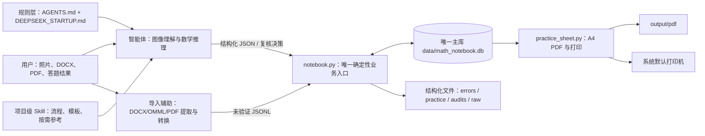
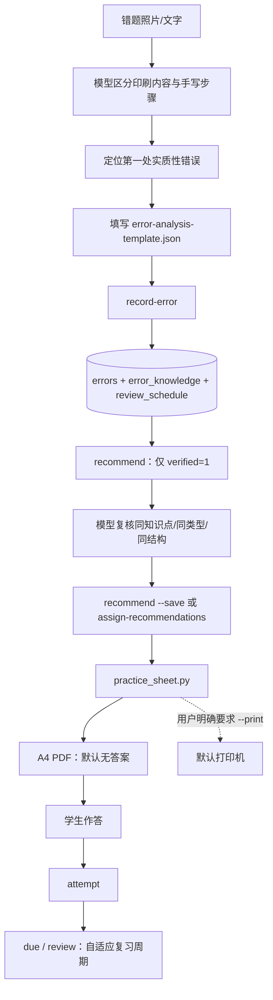
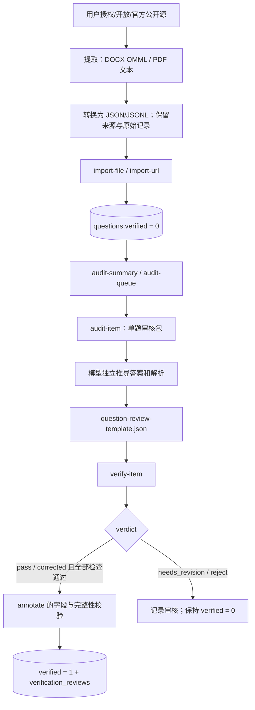
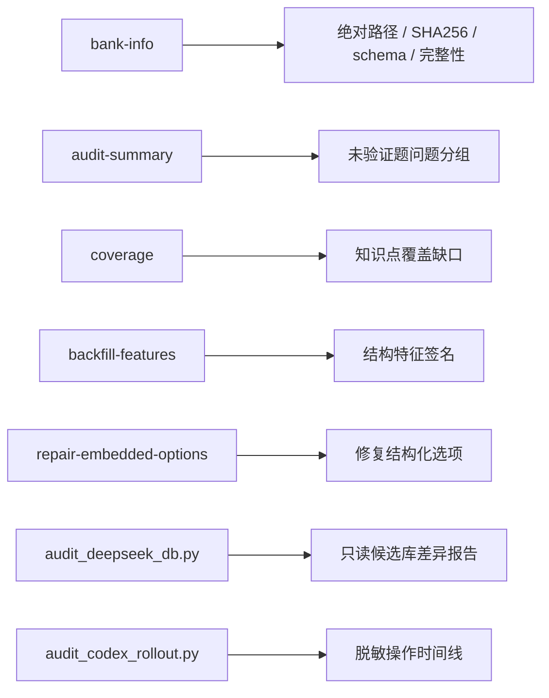
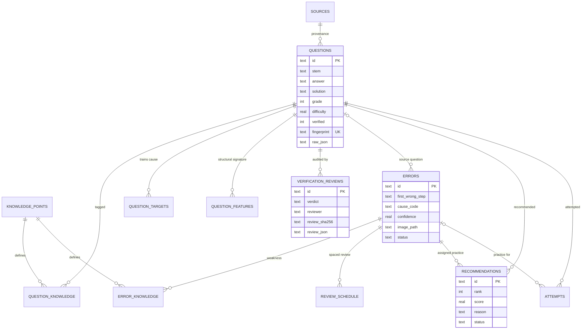

# 李兆霖数学错题本：完整项目架构与功能索引

本文件是智能体的“先查后建”索引。修改或新建功能前，先在这里确认是否已有命令、脚本、数据表或工作流。项目规则以 `AGENTS.md` 和项目级 Skill 为准；本文件解释现有实现，不放宽任何质量规则。

## 1. 当前系统快照

- 正式项目名称：`李兆霖数学错题本`
- 唯一活动题库：`data/math_notebook.db`
- 数据库 schema：`2`
- 题目：`1383`；已验证：`1075`；未验证：`308`
- 来源：`104`；错题记录：`8`
- 主执行器：`.agents/skills/math-error-notebook/scripts/notebook.py`
- 组卷与打印：`.agents/skills/math-error-notebook/scripts/practice_sheet.py`
- 默认打印机：`EPSON72097C (L3250 Series)`

数量是 2026-07-22 的交接快照；实际状态以 `bank-info --json` 为准。

## 2. 总体架构



职责边界：智能体负责识别题目、定位首个错误、独立数学推导和相关性复核；脚本负责校验格式、数据库事务、去重、状态更新、检索、组卷和打印。不得用脚本伪造数学审核，也不得让模型直接改数据库。

## 3. 三条核心业务链

### 3.1 照片批改、推荐、打印与复习



### 3.2 授权题目导入与逐题验证

`2026-07-19-g11-beijing-20` 是用户确认的可靠来源批次，可免每题完整独立推演；仍须逐题检查完整性、重复项、答案解析自洽、标签与来源，并通过 `audit-item → verify-item`。其他来源继续执行下图中的完整独立推导流程。



### 3.3 题库维护与审计



## 4. 权威入口与优先级

| 优先级 | 入口 | 用途 | 是否可写主库 |
|---|---|---|---|
| 1 | `.agents/.../scripts/notebook.py` | 全部常规业务、导入、审核、推荐和学习状态 | 是，受校验约束 |
| 2 | `.agents/.../scripts/practice_sheet.py` | 从已保存推荐生成 PDF 并打印 | 否，仅输出文件/打印 |
| 3 | `scripts/extract_docx_omml.py` + `build_omml_exam_import.py` | DOCX/OMML 提取和未验证导入文件构建 | 否 |
| 3 | `scripts/extract_pdf_text.py` | PDF 原文审核辅助 | 否 |
| 4 | 其他 `scripts/*.py` | 历史批次、取证或专项迁移 | 除明确调用 `notebook.py` 外不得写库 |

新智能体不得创建第二套数据库访问层、推荐器、PDF生成器或验证器。可复用功能应扩展权威入口，并补充 `tests/test_notebook.py`。

## 5. `notebook.py` 全部 CLI 功能

所有命令默认使用唯一主库。`--json` 返回精简 JSON；仅在确有需要时使用 `--full` 或 `--pretty-json`。

| 功能域 | 命令 | 已有能力 |
|---|---|---|
| 智能体启动 | `doctor` | 一次检查唯一主库、schema、完整性、项目文件、PDF 依赖、LibreOffice 和打印配置 |
| 智能体启动 | `agent-context` | 按 grade/recommend/verify/import/review/pdf/maintenance 返回最小规则与命令集合 |
| 智能体交接 | `handoff` | 精简输出主库哈希、验证数量、主要问题、复习任务和 Git 状态 |
| 初始化 | `init` | 创建 schema、装载知识点；主库存在时不得用来重建数据 |
| 初始化 | `seed` | 幂等导入项目原创种子题，仅用于首次建库 |
| 题库身份 | `bank-info` | 主库绝对路径、SHA256、schema、完整性、外键和数量 |
| 文件导入 | `import-file` | 导入授权 JSON、JSONL、CSV；外部题默认未验证 |
| URL导入 | `import-url` | 下载授权结构化数据并保存原始快照 |
| 来源登记 | `register-exam-dir` | 登记本地 PDF 试卷目录并生成来源清单 |
| 来源同步 | `sync-source-manifest` | 将来源清单同步到题库来源记录 |
| 来源修复 | `update-source` | 修正一个来源的 URL、许可、授权确认和备注 |
| 来源查询 | `sources` | 精简列出来源及题目/已验证数量，供批量导入幂等判断 |
| 错题保存 | `record-error` | 保存结构化错因、图片、知识点和复习周期 |
| 错题预检/保存 | `grade-preview` / `grade-commit` | 写库前验证错因 JSON；粗心必须有直接证据；提交复用同一质量门 |
| 错题撤销 | `delete-error` | 删除误保存的错题及受控派生文件 |
| 推荐预览/保存 | `recommend` | 按知识点、错因、难度、作答史、关键词和结构特征排序已验证题 |
| 推荐审核包 | `recommend-packet` | 将完整候选写入本地审核包，只返回精简 ID，不保存推荐 |
| 人工推荐 | `assign-recommendations` | 用模型逐题复核后的已验证题替换自动候选 |
| 复习到期 | `due` | 查询到期或逾期复习任务 |
| 复习反馈 | `review` | 记录 correct/partial/wrong，并在失败时启动新周期 |
| 作答记录 | `attempt` | 保存推荐题对错、答案和新的错因 |
| 检索 | `search` | 按知识点、年级、难度、文本、验证状态精简检索 |
| 单题详情 | `question` | 按 ID 读取一个完整题目；`--raw` 才读取原始导入记录 |
| 代码查询 | `knowledge` | 精简查询知识点代码 |
| 代码查询 | `causes` | 精简查询错因代码 |
| 代码查询 | `features` | 精简查询题目结构特征代码 |
| 单题标注 | `annotate` | 修正题干/答案/解析/标签/难度/题型；内部验证质量门 |
| 审核队列 | `audit-queue` | 精简列出未验证题，可按来源过滤 |
| 审核包 | `audit-item` | 汇总一题的内容、来源、问题、近重复项和审核要求 |
| 审核脚手架 | `prepare-audit-batch` | 生成逐题审核包和 verdict=pending 的审核 JSON，不修改数据库 |
| 精简审核扩展 | `prepare-review-batch` | 将模型逐题给出的精简决策扩展为完整审核 JSON，不替代数学判断、不写库 |
| 结构化验证 | `verify-item` | 接受独立审核 JSON；逐题记录并在通过时提升状态 |
| 批量提交审核 | `verify-review-batch` | 逐项复用 `verify-item` 质量门提交审核文件，只压缩命令输出，不批量放宽验证 |
| 特征回填 | `backfill-features` | 幂等推断题型结构特征，不改变验证状态 |
| 选项修复 | `repair-embedded-options` | 从原始记录或题干回填 A-D 结构化选项 |
| 审核汇总 | `audit-summary` | 按来源统计缺解析、异常公式、占位答案、图形依赖等 |
| 学习统计 | `stats` | 错题、推荐、正确率、薄弱知识点和错因统计 |
| 课程覆盖 | `coverage` | 按课程知识点统计已验证题覆盖 |

### 内部函数分组

不要重新实现这些内部能力；需要变更时直接修改现有函数并补测试。

- 数据库与标识：`default_database_path`、`connect`、`init_database`、`fingerprint`、`slug_id`、`bank_info`
- 题目标准化：`infer_knowledge`、`infer_question_features`、`validate_feature_codes`、`normalize_difficulty`、`normalize_question`、`insert_question`
- 导入与来源：`import_records`、`read_json_records`、`fetch_json`、`register_exam_directory`、`sync_source_manifest`、`update_source_metadata`、`list_sources`
- 错题与复习：`create_review_cycle`、`render_error_markdown`、`validate_error_analysis`、`record_error`、`fetch_error`、`delete_error`、`review_due`、`mark_review`、`record_attempt`
- 推荐：`compact_recommendations`、`question_feature_codes`、`backfill_question_features`、`error_feature_codes`、`recommend`、`recommendation_packet`、`assign_recommendations`
- 检索与统计：`stats`、`coverage`、`list_knowledge_points`、`list_cause_codes`、`list_feature_codes`、`question_detail`、`search_questions`
- 审核与修复：`annotate_question`、`question_issue_codes`、`near_duplicate_candidates`、`audit_item`、`prepare_audit_batch`、`prepare_verification_reviews`、`apply_verification_review`、`apply_verification_review_batch`、`repair_embedded_options`、`audit_queue`、`audit_summary`
- 启动与交接：`doctor`、`agent_context`、`handoff_snapshot`、`_git_summary`
- CLI：`print_output`、`build_parser`、`main`

## 6. `practice_sheet.py` 完整职责

调用形式：

```powershell
python -B .agents\skills\math-error-notebook\scripts\practice_sheet.py <error-id>
```

已有能力：读取错题及已保存推荐、默认生成无答案练习卷、按需增加答案页、中文字体处理、A4 分页、解析压缩、输出 PDF，并在用户明确要求时通过 LibreOffice/系统打印接口发送到配置的打印机。数学公式支持 `$...$`、`$$...$$`、`\\(...\\)` 与 `\\[...\\]`，通过项目级 `requirements-pdf.txt` 固定依赖并安装到忽略版本控制的 `runtime/pdf`；题图会自动裁除近白边、按 DPI 计算物理尺寸、限制在 110×65 mm 内且不放大小图。

内部函数：`bundled_python`、`missing_pdf_modules`、`ensure_pdf_runtime`、`load_config`、`load_items`、`clean_math`、`truncate_clean_text`、`prepare_diagram_image`、`paragraph_text`、`find_soffice`、`print_pdf`、`create_pdf`、`parse_args`、`main`。

不要为普通推荐题另建 PDF 脚本；应扩展本脚本。

## 7. 根目录辅助脚本清单

| 脚本 | 类型 | 作用 | 新任务使用规则 |
|---|---|---|---|
| `scripts/extract_docx_omml.py` | 通用、只读提取 | 直接读取 OOXML，将微软 OMML 公式转为 LaTeX，导出段落 JSON/Markdown/媒体 | DOCX 精确公式提取首选 |
| `scripts/build_omml_exam_import.py` | 通用批次转换 | 分题、选项/答案/解析配对、图片本地化、初步知识点/难度，输出未验证 JSONL | 与上一脚本配套；导入后仍逐题验证 |
| `scripts/docx_extractor.py` | 实验性一体提取 | 基于 python-docx/lxml 解析 OMML、题目、答案和解析，支持预览/JSONL | 与前两者能力重叠；未完成统一代码映射，未经回归测试不要作为主流程 |
| `scripts/_test_extract.py` | 临时烟雾测试 | 预览 `docx_extractor.py` 前 5 题 | 不是生产入口 |
| `scripts/extract_pdf_text.py` | 通用、只读 | 使用 pypdf 提取分页文本供源文件审核 | 文本型 PDF 使用；扫描 PDF 仍需图像/OCR复核 |
| `scripts/audit_deepseek_db.py` | 历史取证、只读 | 比较候选库与唯一主库，输出插入/删除/字段差异及近似题 | 只生成报告，禁止据此自动合库 |
| `scripts/audit_codex_rollout.py` | 历史取证、只读 | 将 Codex rollout JSONL 脱敏并生成可审核时间线 | 仅在有操作日志文件时使用 |
| `scripts/build_db_correction_map.py` | 专项迁移、只读 | 将重新提取的来源题映射到题库内部 ID | 只产出 correction JSON，不直接改库 |
| `scripts/apply_question_reviews.py` | 旧版批次验证器 | 逐条调用 `annotate --verify` 应用历史审核 manifest | 新审核改用 `audit-item` + `verify-item`；不得用于批量自动验证 |
| `scripts/build_dongzhimen_review.py` | 东直门专项 | 生成该 21 题的更正载荷和审核记录 | 不用于其他试卷 |
| `scripts/extract_dongzhimen.py` | 东直门旧流程 | 从特定文本布局切分该试卷 | 已被 OMML 流程替代，不泛化 |
| `scripts/convert_dongzhimen.py` | 东直门旧流程 | 将该试卷旧提取结果转换为导入 JSONL | 不泛化 |
| `scripts/generate_q6_targeted_practice_pdf.py` | 第六题专项 | 生成一次性的圆心/切线专题 PDF | 普通推荐打印改用 `practice_sheet.py` |

## 8. Skill 资源

| 路径 | 内容 | 何时读取/使用 |
|---|---|---|
| `.agents/.../SKILL.md` | 核心流程和不变量 | 每个错题本任务都读 |
| `agents/openai.yaml` | Skill 显示名、默认提示和隐式触发配置 | Codex 发现 Skill 时使用 |
| `assets/error-analysis-template.json` | 错题结构化保存模板 | 照片/文字批改 |
| `assets/question-review-template.json` | 单题独立验证模板 | `audit-item` 后、`verify-item` 前 |
| `assets/knowledge-points.json` | 高中数学知识点代码表 | 初始化和代码查询 |
| `assets/seed-questions.jsonl` | 项目原创已验证种子题 | 仅首次建库 |
| `references/error-taxonomy.md` | 错因定义和判定边界 | 错因不明确时按需读 |
| `references/data-contract.md` | 错题和题目 JSON 契约 | 模板校验失败或构建导入时读 |
| `references/import-and-verification.md` | 授权导入和两阶段验证 | 仅导入/验证任务读 |

## 9. 数据库关系



数据库共有 13 张业务/元数据表：`metadata`、`sources`、`knowledge_points`、`questions`、`question_knowledge`、`question_targets`、`question_features`、`verification_reviews`、`errors`、`error_knowledge`、`review_schedule`、`recommendations`、`attempts`。

## 10. 文件与目录所有权

```text
math-error-notebook/
├─ AGENTS.md                         项目硬规则
├─ DEEPSEEK_STARTUP.md               外部模型启动交接
├─ PROJECT_ARCHITECTURE.md           本文件：先查后建索引
├─ .codex/rules.md                    旧版 Codex 兼容提示；不替代 AGENTS.md
├─ .agents/skills/math-error-notebook/
│  ├─ SKILL.md                       智能体工作流
│  ├─ scripts/notebook.py            唯一业务/数据库入口
│  ├─ scripts/practice_sheet.py      PDF与打印入口
│  ├─ assets/                        JSON模板、代码表、种子题
│  └─ references/                    按需读取的详细规范
├─ data/
│  ├─ math_notebook.db               唯一活动题库
│  ├─ raw/                           原始结构化导入快照
│  ├─ imports/                       试卷提取与批次中间物
│  ├─ audits/                        审核包、审核结果和历史审计
│  ├─ images/                        错题原图副本
│  └─ backups/                       受控数据库备份，不是活动库
├─ errors/YYYY-MM/                   可读错题报告
├─ practice/                         推荐练习 Markdown
├─ output/pdf/                       A4打印版 PDF
├─ config/math-error-notebook.json   打印配置
├─ scripts/                          导入、取证、迁移和专项工具
└─ tests/test_notebook.py            核心功能回归测试
```

## 11. 防止重复造功能的决策表

| 想做的事情 | 先使用 | 不要新建 |
|---|---|---|
| 保存错题 | `record-error` | 第二套错题 JSON/数据库 |
| 检索题目 | `search`、`question` | 全库扫描脚本 |
| 推荐同类题 | `recommend`、`assign-recommendations` | 新推荐器或直接 SQL |
| 输出/打印练习 | `practice_sheet.py` | 新通用 PDF 生成器 |
| 导入 JSON/CSV | `import-file` | 新数据库导入器 |
| 导入 DOCX | `extract_docx_omml.py` + `build_omml_exam_import.py` + `import-file`；日期批次用 `scripts/import_recent_docx_batch.py` 编排 | 第三套 OMML 转换器 |
| 审核未验证题 | `prepare-audit-batch` + `verify-item`；已完成人工审核的清单可用 `verify-review-batch` | 批量 verified 更新脚本 |
| DOCX 结构预检 | `scripts/audit_recent_docx_batch.py` | 让模型重复检查字段、图片路径和格式 |
| 修复题目字段 | `annotate` 或审核 JSON 的 correction | 直接 UPDATE SQL |
| 查询题库状态 | `bank-info`、`audit-summary`、`coverage`、`stats` | 递归扫描和临时报表脚本 |
| 分析其他数据库 | `audit_deepseek_db.py` 只读报告 | 自动合库程序 |
| 记录练习结果 | `attempt`、`review` | 独立成绩文件 |

只有以下情况适合增加代码：现有入口确实无法表达需求；功能可重复使用；不会绕过质量门；明确归属到现有模块；同时增加回归测试和本文索引。

## 12. 智能体低 Token 快速路径

常规任务不再人工拼接预检、审核包或交接摘要。先运行：

```powershell
python -B .agents\skills\math-error-notebook\scripts\notebook.py doctor --json
python -B .agents\skills\math-error-notebook\scripts\notebook.py agent-context --task <task> --json
```

固定流程：

- 判题：`grade-preview → grade-commit`
- 推荐：`recommend-packet → 模型复核 → assign-recommendations`
- 批量 DOCX：`import_recent_docx_batch.py → audit_recent_docx_batch.py`
- 验证：`prepare-audit-batch → 模型输出精简决策 → prepare-review-batch → verify-review-batch`
- 交接：`handoff`

尚未程序化、也不应伪自动化的部分：照片内容理解、第一处实质性错误定位、独立数学推导、答案/解析逻辑判断、推荐题真实相关性复核。模型行为标准案例集仍待建立。

如用户要求实现这些能力，应优先扩展 `notebook.py`、模板和测试，而不是创建平行系统。

## 13. 修改前后的最小检查

修改前：

```powershell
python -B .agents\skills\math-error-notebook\scripts\notebook.py doctor --json
```

修改代码后：

```powershell
python -B -m unittest discover -s tests -v
python -B .agents\skills\math-error-notebook\scripts\notebook.py handoff --json
```

题库写入后必须报告具体 ID、数量变化、完整性和外键结果。不得只凭对话声明完成。
