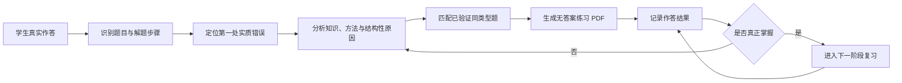
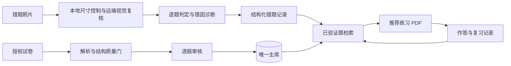

<p align="center">
  
</p>

# 李兆霖数学错题本

> **教育同权，让每个孩子都能获得高质量、可持续的个性化学习支持。**

这不是一个单纯“保存错题”的文件夹，也不是一个自动给答案的工具。它是一套面向高中数学学习的本地智能学习系统：从学生真实作答出发，找到第一处实质错误，解释错误为什么发生，再从经过验证的题库中安排适合当前水平的同类训练，并通过持续复习确认问题是否真正解决。

项目希望把优秀教师处理错题时最有价值的部分——**看懂学生的思路、诊断错误根源、安排恰当练习、持续追踪掌握情况**——沉淀为一套可检查、可复用、可跨智能体执行的标准流程。

## 项目起因

传统错题本通常解决了“把错题记下来”，却没有完整解决后面的学习问题：

- 学生知道答案错了，却不知道自己的思路从哪一步开始偏离；
- 错因常被简单归结为“粗心”，知识缺口、方法误用和分类遗漏没有被区分；
- 重新找题依赖家长或老师临时搜索，题型、难度和质量难以稳定控制；
- 错题订正一次后很少继续追踪，短期会做不等于真正掌握；
- 优质的一对一诊断高度依赖教师时间，难以持续覆盖每一次日常练习。

李兆霖数学错题本由真实的高中数学学习需求逐步发展而来。它试图回答一个朴素的问题：**能否把一次错误转化为一条完整、可靠、能够持续执行的学习路径？**

因此，系统关注的不是“收集了多少题”，而是每道错题之后是否发生了有效改变：学生是否理解了第一处错误，是否完成了适量的同类训练，是否在后续复习中稳定做对。

## 核心原理

系统采用“证据驱动诊断 + 已验证题库 + 自适应复习”的闭环：



1. **以学生作答为证据**：照片 OCR 只负责减少录入成本，数学公式、图形和手写步骤仍需视觉复核；看不清的内容不会被静默补造。
2. **先找第一处实质错误**：不只比较最终答案，而是还原学生的解题路径，找到最早改变结论的错误步骤。
3. **把错因结构化**：将知识点、题型结构、难度、错误原因和防错提示保存下来，使后续推荐和统计有可靠依据。
4. **只从已验证题库推荐**：推荐题必须经过来源、题干、答案、解析、标签和重复项审核，避免用未经核验的生成题冒充可靠练习。
5. **训练强度随表现变化**：从同难度巩固逐步过渡到变式和略高难度迁移；答错或部分正确时重新进入针对性循环。
6. **程序与大模型分工**：程序负责 OCR、缓存、去重、检索、事务、组卷和计划；大模型负责理解作答、数学推理和相关性判断。两者互相约束，而不是让模型直接修改题库。

## 项目价值

### 对学生

- 每次判题都会明确说明“错在哪里、为什么错、正确方法是什么、下一步做什么”；
- 推荐题数量和难度受控，减少无目的刷题；
- 通过分阶段复习检验是否真正掌握，而不是只看一次订正结果；
- 逐步形成对自己常见错误模式和薄弱知识点的认识。

### 对家长和教师

- 将零散照片、订正、推荐题和复习结果连接成可追踪记录；
- 用统一标准区分知识缺口、方法错误、分类遗漏、计算错误与信息不清；
- 自动完成大量机械工作，把时间留给真正需要判断和沟通的部分；
- 可以查看推荐依据、题目来源和审核状态，而不是接受不可解释的“智能推荐”。

### 对教育资源公平

项目所追求的“教育同权”，不是简单堆积更多题目，而是降低获得高质量个性化反馈的门槛。优秀教育最稀缺的往往不是一道题的答案，而是有人持续看见学生的思考过程，并在恰当的时间给出恰当的下一步。本项目尝试把这种服务变成一套本地可运行、长期可积累、能够被不同智能体稳定执行的学习基础设施。

### 对隐私和可持续使用

- 题库、错题照片和学习记录保存在本地，不依赖某个在线平台长期存续；
- 唯一主库、验证记录和 Git 历史使重要修改可以追溯；
- Kimi、DeepSeek、Codex 等不同智能体通过同一 Skill、规则和命令入口协作，减少重复建设与标准漂移；
- 固定流程尽量程序化，降低 Token 消耗和长期运行成本。

## 它不是什么

- 不是替代教师或家长判断的“全自动老师”；
- 不是只看最终答案、自动贴上“粗心”标签的判题器；
- 不是未经验证便批量生成推荐题的题海工具；
- 不是绕过版权、登录、付费墙或访问限制的试题抓取器；
- 不是让 OCR 或大模型直接决定题库真实性的黑箱系统。

项目提供两个二选一的 Skill 安装包：纯 Codex 版和 Codex + Harness 省 Token 版。两者共用同一套数据规范、验证门槛和命令行入口，避免重复创建题库、推荐器或审核流程。

## 核心能力

- **照片批改**：本地只做 EXIF 方向、透明底白底化与尺寸压缩，远端视觉模型直接查看标准化预览并判题；RapidOCR、PaddleOCR 和本地 Qwen 仅保留为显式诊断工具。
- **步骤级诊断**：定位第一处实质错误，区分知识点未掌握、方法选择错误、计算错误等原因。
- **可信题库**：记录年级、难度、知识点、来源、许可、结构特征、去重指纹和验证状态。
- **针对性推荐**：只从已验证题中按知识点、错因、难度和历史表现推荐同类型练习。
- **练习 PDF**：生成适合 A4 打印的无答案练习卷；仅在明确要求时附答案或调用打印机。
- **复习闭环**：记录作答结果、复习日期、薄弱知识点和重复错因，生成每日复习任务。
- **试卷入库**：导入用户授权的 DOCX、PDF 及结构化题目，经过质量门和逐题审核后进入主库。
- **低 Token 工作流**：图片尺寸控制、批量审核包、结构化决策扩展和 SymPy 预检均由本地脚本完成；远端只接收适合判读的标准化预览。
- **可控的 DeepSeek Harness（省 Token 版）**：可把文字判题分析、文本题审核候选、推荐复核和标签建议交给 DeepSeek；本地程序校验输入、ID、标签和置信度，DeepSeek 不直接写题库。

## 工作流程



## 关键设计约束

1. 唯一主库固定为 `data/math_notebook.db`，不得搜索、合并或改用其他同名数据库。
2. 推荐题必须已经验证，并显示来源和推荐理由。
3. 默认判题不运行 OCR；数学公式、图形和手写步骤由远端视觉模型直接复核。显式诊断所得 OCR 也只能作辅助。
4. 透明 PNG 只在审核看图阶段生成白底预览，原始入库图片保持不变。
5. 未验证题不得作为推荐题；来源信誉不能替代逐题审核。
6. 只导入开放授权、官方公开或用户确认有权使用的材料。
7. 项目文本统一使用 UTF-8，Windows 命令按项目规范显式启用 UTF-8。

## 环境要求

- Windows 10/11
- Python 3.11 或更高版本
- LibreOffice（DOCX/PDF 转换与版面检查，可选但推荐）
- 默认打印机（仅在需要直接打印时使用）

安装基础依赖：

```powershell
python -X utf8 -B -m pip install -r requirements-math.txt
python -X utf8 -B -m pip install -r requirements-pdf.txt
python -X utf8 -B -m pip install -r requirements-ocr.txt
```

PaddleOCR 公式识别为可选能力：

```powershell
python -X utf8 -B -m pip install -r requirements-paddleocr.txt
```

只有 Codex + Harness 省 Token 版需要 DeepSeek 客户端。依赖隔离安装到项目运行目录：

```powershell
python -X utf8 -B -m pip install --target .runtime\deepseek `
  -r skill-packages\math-error-notebook-harness\scripts\requirements-deepseek.txt
```

API Key 仅通过 `DEEPSEEK_API_KEY` 环境变量读取，不写入仓库或候选文件。

## 快速开始

### 选择安装包

两个安装包功能基线一致，只能二选一安装：

| 安装包 | 适合场景 | 模型分工 | 额外配置 |
|---|---|---|---|
| **纯 Codex 版** `math-error-notebook` | 希望配置最少、全部由 Codex 完成 | Codex 负责视觉、数学判断、审核、推荐与最终写入复核 | 无 |
| **Codex + Harness 省 Token 版** `math-error-notebook-harness` | 已有 DeepSeek API，希望减少 Codex 的文字推理消耗 | DeepSeek 处理受限的文字判题、文本审核、推荐复核和标签候选；Codex 负责看图、疑难升级和最终写入复核 | `DEEPSEEK_API_KEY` 与隔离客户端 |

两版都只通过 `notebook.py` 访问唯一主库；Harness 永远不直接写数据库。照片、图形、歧义内容、低置信度结果和正式提交仍交给 Codex。不要同时安装两版，以免同一请求触发两个 Skill。

#### 安装纯 Codex 版

在 Codex 中输入下面这句话即可从 GitHub 安装：

```text
使用 $skill-installer 安装 https://github.com/chjesu/lizhaolin-math-error-notebook/tree/master/.agents/skills/math-error-notebook
```

#### 安装 Codex + Harness 省 Token 版

```text
使用 $skill-installer 安装 https://github.com/chjesu/lizhaolin-math-error-notebook/tree/master/skill-packages/math-error-notebook-harness
```

安装后设置 `DEEPSEEK_API_KEY`，并按上方命令把依赖安装到项目的 `.runtime\deepseek`。首次连接可直接说：

```text
使用 $math-error-notebook-harness 检查并连接当前项目；适合的文字任务交给 DeepSeek Harness，看图、疑难项和最终写入由 Codex 处理。
```

安装任一版本后重启 Codex。Skill 会优先连接环境变量
`LIZHAOLIN_MATH_NOTEBOOK_ROOT` 指定的项目；未设置时，从当前工作目录向上寻找
`data/math_notebook.db`。因此，使用本项目现有题库时应先在 Codex 中打开本仓库目录。
生产题库、学生照片和学习记录不会随 GitHub Skill 分发；在新目录首次建立空白错题本时，才运行 `init` 和 `seed`。

安装后最简单的开始方式是，在 Codex 中打开原错题本项目文件夹并说：

```text
使用 $math-error-notebook 检查并连接当前项目的题库，告诉我是否可以正常使用；不要初始化或覆盖题库。
```

如果要新建空白错题本，请先打开准备用来保存数据的空文件夹，然后说：

```text
使用 $math-error-notebook 在当前文件夹新建数学错题本，导入内置原创例题，并检查是否可以正常使用。不要查找或连接其他题库。
```

连接成功后可以直接说：

- `批改这些数学作业照片，保存错因，并明确告诉孩子下一步做什么。`
- `根据刚才的错因推荐3道已验证同类型题，生成无答案PDF，先不打印。`
- `查看今天到期的复习任务，生成一份无答案复习PDF。`
- `把我提供且有权使用的数学试卷导入题库，先作为未验证题再审核。`

练习PDF默认不附答案、不打印；只有用户明确要求时才显示答案或调用打印机。

首次使用先进行环境和主库检查：

```powershell
python -X utf8 -B .agents\skills\math-error-notebook\scripts\notebook.py doctor --json
python -X utf8 -B .agents\skills\math-error-notebook\scripts\notebook.py bank-info --json
```

仅在全新环境且主库不存在时初始化：

```powershell
python -X utf8 -B .agents\skills\math-error-notebook\scripts\notebook.py init
python -X utf8 -B .agents\skills\math-error-notebook\scripts\notebook.py seed
```

> 已存在生产主库时，不要重复执行 `init` 或 `seed`。

## 常用命令

### 照片错题

```powershell
# 本地仅控制尺寸；随后由当前远端视觉模型打开全部 preview_paths
python -X utf8 -B .agents\skills\math-error-notebook\scripts\notebook.py photo-preflight <照片路径> --task grade --json

# 仅在明确诊断 OCR 时使用较慢的旧链路
python -X utf8 -B .agents\skills\math-error-notebook\scripts\notebook.py photo-preflight <照片路径> --preflight-mode ocr --formula-ocr off --vision-mode off --json

# 生成判题预览；确认后再提交正式记录
python -X utf8 -B .agents\skills\math-error-notebook\scripts\notebook.py grade-preview <判题输入JSON> --json
python -X utf8 -B .agents\skills\math-error-notebook\scripts\notebook.py grade-commit <预览JSON> --json
```

### 推荐与复习

```powershell
# 生成结构化推荐包
python -X utf8 -B .agents\skills\math-error-notebook\scripts\notebook.py recommend-packet <错题ID> --json

# 查看到期复习与薄弱项
python -X utf8 -B .agents\skills\math-error-notebook\scripts\notebook.py due --json
python -X utf8 -B .agents\skills\math-error-notebook\scripts\notebook.py stats --json
python -X utf8 -B .agents\skills\math-error-notebook\scripts\notebook.py coverage --json
```

### 试卷入库与验证

按日期导入下载目录中的 DOCX：

```powershell
python -X utf8 -B scripts\import_recent_docx_batch.py C:\Users\Administrator\Downloads `
  --from-date 2026-08-01 --to-date 2026-08-01 `
  --batch-name example-batch --license User-Provided-Authorized --import
```

结构预检与正式审核：

```powershell
python -X utf8 -B scripts\audit_recent_docx_batch.py <批次清单JSON> --out-dir <审核目录> --reviewer Codex

python -X utf8 -B .agents\skills\math-error-notebook\scripts\notebook.py prepare-review-batch `
  <精简审核决策JSON> --out-dir <逐题审核目录> --json

python -X utf8 -B .agents\skills\math-error-notebook\scripts\notebook.py verify-review-batch `
  <逐题审核目录\manifest.json> --json
```

单题审核入口：

```powershell
python -X utf8 -B .agents\skills\math-error-notebook\scripts\notebook.py audit-item <题目ID> --json
python -X utf8 -B .agents\skills\math-error-notebook\scripts\notebook.py verify-item <题目ID> <审核JSON> --json
```

### 将文本任务下放给 DeepSeek Harness（仅省 Token 版）

```powershell
# 文字作答或已由视觉模型完成可信转录的判题证据；JSON 必须声明 student_work_has_steps
python -X utf8 -B skill-packages\math-error-notebook-harness\scripts\deepseek_worker.py `
  <证据JSON> --task grade --out <判题候选JSON>

# 审核包：含图题、低置信度和矛盾项会自动交回 Codex
python -X utf8 -B skill-packages\math-error-notebook-harness\scripts\deepseek_worker.py `
  <审核manifest.json> --task verify --out <精简决策JSON>

# 只允许从 recommend-packet 提供的已验证候选中选择
python -X utf8 -B skill-packages\math-error-notebook-harness\scripts\deepseek_worker.py `
  <推荐审核包JSON> --task recommend --out <已复核推荐JSON>

# 仅产生标签候选，不修改题目
python -X utf8 -B skill-packages\math-error-notebook-harness\scripts\deepseek_worker.py `
  <题目JSON> --task tag --out <标签候选JSON>
```

该入口始终返回 `database_modified=false`。输出中的 `next_command` 只是后续
人工/Codex 复核提示；正式写入仍须通过 `grade-commit`、
`verify-review-batch`、`assign-recommendations` 或 `annotate` 的权威质量门。
DeepSeek 无视觉输入时不得判读照片，含图审核也会自动升级给具备视觉能力的模型。

## 目录结构

```text
.
├─ .agents/skills/math-error-notebook/  # 项目 Skill、权威 CLI、模板与数据规范
├─ skill-packages/math-error-notebook-harness/ # 可单独安装的 Codex + Harness 省 Token 版
├─ assets/branding/                     # Logo、图标和品牌资源
├─ config/                              # 项目配置
├─ data/                                # 本地主库、导入与审核数据（大部分不提交 Git）
├─ docs/                                # 专项文档
├─ scripts/                             # 导入、审核、提取和维护脚本
├─ tests/                               # 自动化测试
├─ AGENTS.md                            # 所有智能体必须遵守的项目规则
└─ PROJECT_ARCHITECTURE.md              # 完整架构和防重复开发索引
```

## 测试

```powershell
python -X utf8 -B -m unittest discover -s tests -p "test_*.py"
```

修改代码后至少运行与改动相关的测试；涉及权威 CLI、导入、PDF 或 OCR 时，应运行完整测试并执行：

```powershell
python -X utf8 -B .agents\skills\math-error-notebook\scripts\notebook.py doctor --json
```

## 数据与隐私

Git 仓库用于保存代码、测试、配置模板、项目文档和品牌资源。以下内容默认不随仓库分发：

- `data/math_notebook.db` 生产主库
- 错题照片和学生作答
- 导入试卷原件及媒体文件
- 审核包、练习输出和临时诊断文件

克隆仓库不会自动获得生产题库。部署到新环境时，应按数据授权和备份策略单独准备本地主库。

## 文档入口

- [`PROJECT_ARCHITECTURE.md`](PROJECT_ARCHITECTURE.md)：完整架构、脚本职责和防重复开发索引
- [`AGENTS.md`](AGENTS.md)：智能体工作规则与质量门
- [`SIMPLIFIED_VERIFICATION_POLICY.md`](SIMPLIFIED_VERIFICATION_POLICY.md)：高质量来源的简化审核规则
- [`data/CANONICAL_QUESTION_BANK.md`](data/CANONICAL_QUESTION_BANK.md)：唯一主库约定
- [`.agents/skills/math-error-notebook/SKILL.md`](.agents/skills/math-error-notebook/SKILL.md)：Skill 使用说明
- [`skill-packages/math-error-notebook-harness/SKILL.md`](skill-packages/math-error-notebook-harness/SKILL.md)：Codex + Harness 省 Token 版说明

## 使用范围

本项目用于个人学习与授权教学材料管理。题目及解析的著作权归各自来源方所有；不得利用本项目绕过登录、付费墙、访问控制或材料授权限制。
