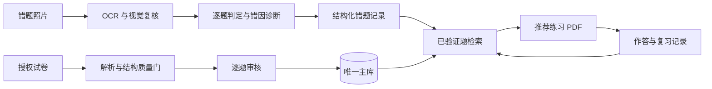

<p align="center">
  
</p>

# 李兆霖数学错题本

面向高中数学学习的本地智能错题系统。项目围绕“照片判题 → 错因诊断 → 已验证题推荐 → PDF 练习 → 间隔复习”建立闭环，同时提供授权试卷导入、逐题审核、题库维护和跨学科下载监听能力。

项目由项目级 `math-error-notebook` Skill 驱动，所有智能体共用同一套数据规范、验证门槛和命令行入口，避免重复创建题库、推荐器或审核流程。

## 核心能力

- **照片批改**：结合 RapidOCR、可选 PaddleOCR 公式候选和视觉复核识别题目及手写步骤。
- **步骤级诊断**：定位第一处实质错误，区分知识点未掌握、方法选择错误、计算错误等原因。
- **可信题库**：记录年级、难度、知识点、来源、许可、结构特征、去重指纹和验证状态。
- **针对性推荐**：只从已验证题中按知识点、错因、难度和历史表现推荐同类型练习。
- **练习 PDF**：生成适合 A4 打印的无答案练习卷；仅在明确要求时附答案或调用打印机。
- **复习闭环**：记录作答结果、复习日期、薄弱知识点和重复错因，生成每日复习任务。
- **试卷入库**：导入用户授权的 DOCX、PDF 及结构化题目，经过质量门和逐题审核后进入主库。
- **低 Token 工作流**：OCR 预处理、批量审核包、结构化决策扩展和 SymPy 预检均由本地脚本完成。

## 工作流程



## 关键设计约束

1. 唯一主库固定为 `data/math_notebook.db`，不得搜索、合并或改用其他同名数据库。
2. 推荐题必须已经验证，并显示来源和推荐理由。
3. OCR 只作辅助；数学公式、图形和手写步骤必须视觉复核。
4. 透明 PNG 只在审核看图阶段生成白底预览，原始入库图片保持不变。
5. 未验证题不得作为推荐题；来源信誉不能替代逐题审核。
6. 只导入开放授权、官方公开或用户确认有权使用的材料。
7. 项目文本统一使用 UTF-8，Windows 命令按项目规范显式启用 UTF-8。

## 环境要求

- Windows 10/11
- Python 3.11 或更高版本
- LibreOffice（DOCX/PDF 转换与版面检查，可选但推荐）
- 默认打印机（仅在需要直接打印时使用）

安装基础依赖：

```powershell
python -X utf8 -B -m pip install -r requirements-math.txt
python -X utf8 -B -m pip install -r requirements-pdf.txt
python -X utf8 -B -m pip install -r requirements-ocr.txt
```

PaddleOCR 公式识别为可选能力：

```powershell
python -X utf8 -B -m pip install -r requirements-paddleocr.txt
```

## 快速开始

首次使用先进行环境和主库检查：

```powershell
python -X utf8 -B .agents\skills\math-error-notebook\scripts\notebook.py doctor --json
python -X utf8 -B .agents\skills\math-error-notebook\scripts\notebook.py bank-info --json
```

仅在全新环境且主库不存在时初始化：

```powershell
python -X utf8 -B .agents\skills\math-error-notebook\scripts\notebook.py init
python -X utf8 -B .agents\skills\math-error-notebook\scripts\notebook.py seed
```

> 已存在生产主库时，不要重复执行 `init` 或 `seed`。

## 常用命令

### 照片错题

```powershell
# OCR 与图片预检
python -X utf8 -B .agents\skills\math-error-notebook\scripts\notebook.py photo-preflight <照片路径> --json

# 生成判题预览；确认后再提交正式记录
python -X utf8 -B .agents\skills\math-error-notebook\scripts\notebook.py grade-preview <判题输入JSON> --json
python -X utf8 -B .agents\skills\math-error-notebook\scripts\notebook.py grade-commit <预览JSON> --json
```

### 推荐与复习

```powershell
# 生成结构化推荐包
python -X utf8 -B .agents\skills\math-error-notebook\scripts\notebook.py recommend-packet <错题ID> --json

# 查看到期复习与薄弱项
python -X utf8 -B .agents\skills\math-error-notebook\scripts\notebook.py due --json
python -X utf8 -B .agents\skills\math-error-notebook\scripts\notebook.py stats --json
python -X utf8 -B .agents\skills\math-error-notebook\scripts\notebook.py coverage --json
```

### 试卷入库与验证

按日期导入下载目录中的 DOCX：

```powershell
python -X utf8 -B scripts\import_recent_docx_batch.py C:\Users\Administrator\Downloads `
  --from-date 2026-08-01 --to-date 2026-08-01 `
  --batch-name example-batch --license User-Provided-Authorized --import
```

结构预检与正式审核：

```powershell
python -X utf8 -B scripts\audit_recent_docx_batch.py <批次清单JSON> --out-dir <审核目录> --reviewer Codex

python -X utf8 -B .agents\skills\math-error-notebook\scripts\notebook.py prepare-review-batch `
  <精简审核决策JSON> --out-dir <逐题审核目录> --json

python -X utf8 -B .agents\skills\math-error-notebook\scripts\notebook.py verify-review-batch `
  <逐题审核目录\manifest.json> --json
```

单题审核入口：

```powershell
python -X utf8 -B .agents\skills\math-error-notebook\scripts\notebook.py audit-item <题目ID> --json
python -X utf8 -B .agents\skills\math-error-notebook\scripts\notebook.py verify-item <题目ID> <审核JSON> --json
```

## 下载目录自动入库

跨学科监听统一使用：

- `services/exam_ingest_watcher.py`
- `config/exam-ingest-watcher.json`

监听器只编排数学、物理、化学项目已有的转换器和权威 CLI，不直接写数据库。仅在质量门、导入结果和 `bank-info` 完整性均通过，或权威入口确认重复时，源试卷才会移至 E 盘归档目录。

详细说明见 [`docs/EXAM_INGEST_WATCHER.md`](docs/EXAM_INGEST_WATCHER.md)。

## 目录结构

```text
.
├─ .agents/skills/math-error-notebook/  # 项目 Skill、权威 CLI、模板与数据规范
├─ assets/branding/                     # Logo、图标和品牌资源
├─ config/                              # 项目与监听器配置
├─ data/                                # 本地主库、导入与审核数据（大部分不提交 Git）
├─ docs/                                # 专项文档
├─ scripts/                             # 导入、审核、提取和维护脚本
├─ services/                            # 长期运行的监听服务
├─ tests/                               # 自动化测试
├─ AGENTS.md                            # 所有智能体必须遵守的项目规则
└─ PROJECT_ARCHITECTURE.md              # 完整架构和防重复开发索引
```

## 测试

```powershell
python -X utf8 -B -m unittest discover -s tests -p "test_*.py"
```

修改代码后至少运行与改动相关的测试；涉及权威 CLI、导入、PDF 或 OCR 时，应运行完整测试并执行：

```powershell
python -X utf8 -B .agents\skills\math-error-notebook\scripts\notebook.py doctor --json
```

## 数据与隐私

Git 仓库用于保存代码、测试、配置模板、项目文档和品牌资源。以下内容默认不随仓库分发：

- `data/math_notebook.db` 生产主库
- 错题照片和学生作答
- 导入试卷原件及媒体文件
- 审核包、练习输出和临时诊断文件

克隆仓库不会自动获得生产题库。部署到新环境时，应按数据授权和备份策略单独准备本地主库。

## 文档入口

- [`PROJECT_ARCHITECTURE.md`](PROJECT_ARCHITECTURE.md)：完整架构、脚本职责和防重复开发索引
- [`AGENTS.md`](AGENTS.md)：智能体工作规则与质量门
- [`SIMPLIFIED_VERIFICATION_POLICY.md`](SIMPLIFIED_VERIFICATION_POLICY.md)：高质量来源的简化审核规则
- [`data/CANONICAL_QUESTION_BANK.md`](data/CANONICAL_QUESTION_BANK.md)：唯一主库约定
- [`.agents/skills/math-error-notebook/SKILL.md`](.agents/skills/math-error-notebook/SKILL.md)：Skill 使用说明

## 使用范围

本项目用于个人学习与授权教学材料管理。题目及解析的著作权归各自来源方所有；不得利用本项目绕过登录、付费墙、访问控制或材料授权限制。
