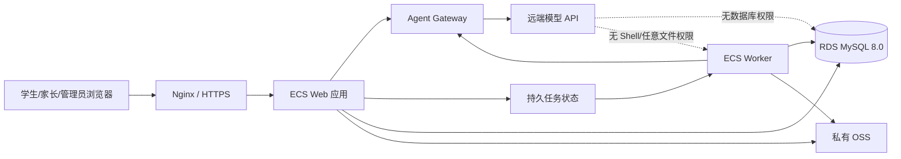
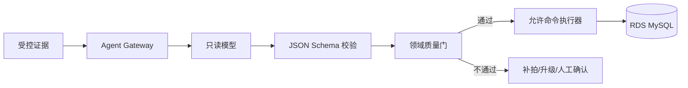

# 技术架构与 Agent 边界护栏

| 属性 | 内容 |
|---|---|
| 版本 | `0.1` |
| 状态 | 待评审 |
| 当前架构 | 本地 Python CLI + SQLite |
| 目标架构 | ECS Web/Worker + RDS MySQL 8.0 + 私有 OSS |

## 1. 架构原则

1. 保留一个业务真相源和一个生产主库。
2. Web 是现有能力的受控入口，不是另一套错题本。
3. 模型负责理解和判断，程序负责权限、校验、事务、状态和审计。
4. 先完成单体应用和一个 Worker；没有量化瓶颈前不拆微服务。
5. 文件和关系数据分离；数据库不保存大图片和 PDF 二进制。
6. 任何质量标准不得因批量、并发或低成本模型而降低。

## 2. 目标部署架构

首版允许 Web 与 Worker 运行在同一 ECS 的不同进程或容器。任务量证明需要扩容后，再拆分 ECS；数据库架构不因此改变。

## 3. 组件职责

| 组件 | 职责 | 明确禁止 |
|---|---|---|
| Nginx | HTTPS、请求体限制、静态资源、反向代理 | 业务写库 |
| Web 应用 | 登录、授权、页面/API、任务创建、结果展示 | 直接执行模型输出中的命令 |
| Worker | 调用现有业务入口、模型路由和质量门 | 绕过 preview/verify/assign 写库 |
| Agent Gateway | 最小上下文、能力白名单、Schema、预算、审计 | 任意工具调用和自由 SQL |
| RDS MySQL | 唯一生产关系数据 | 存储大图片、公开网络访问 |
| 私有 OSS | 原图、预览、试卷原件、PDF | 公开永久读权限 |
| 模型 API | 视觉理解、数学判断、相关性复核 | 数据库凭证、Shell、直接提交业务状态 |

## 4. 现有流程映射

| Web 功能 | 必须复用的权威流程 |
|---|---|
| 照片判题 | `photo-preflight → 视觉模型 → grade-preview → grade-commit` |
| 错题推荐 | `recommend-packet → 模型复核 → assign-recommendations` |
| 每日复习 | `daily-review-packet → practice_sheet.py` |
| 作答记录 | `attempt/correct-attempt/delete-attempt` |
| 复习记录 | `review/correct-review/master-error` |
| 题目审核 | `audit-item → prepare-review-batch → verify-review-batch` |
| PDF | `practice_sheet.py` |

迁移期间可以重构数据访问，但不能复制上述业务规则到 Web 路由中。

## 5. 数据架构

### 5.1 唯一主库

- 切换前：`data/math_notebook.db` 是唯一生产主库。
- 演练期：MySQL 仅承载迁移副本，禁止生产写入。
- 正式切换：冻结 SQLite 写入，完成校验后 MySQL 成为唯一生产主库。
- 切换后：SQLite 仅作为加密归档和回滚窗口内的只读快照。

### 5.2 MySQL 基线

- 数据库版本：RDS MySQL 8.0。
- 默认字符集：`utf8mb4`。
- 业务文本使用适合中文的 `utf8mb4` 排序规则。
- 题库 ID、哈希、幂等键使用区分大小写的二进制排序规则。
- 结构化审核载荷使用原生 JSON 字段，但关键查询字段保持关系化列和索引。
- 中文题干召回使用 InnoDB `FULLTEXT ... WITH PARSER ngram`。
- 暂不引入向量数据库；推荐继续以知识点、错因、结构特征、难度、作答史和全文召回为主。

### 5.3 对象存储

OSS 对象键由服务器生成，不接受用户提供的路径。数据库保存：

- 对象键。
- SHA-256。
- MIME 和尺寸。
- 所属学生/任务。
- 原图/预览/PDF类型。
- 创建时间和保留状态。

对象默认私有；浏览器通过短时签名 URL 上传或下载。模型只接收当前任务所需的临时对象，不获得 Bucket 凭证。

## 6. Agent Gateway

### 6.1 权限矩阵

| Agent | 可读 | 可输出 | 不可执行 |
|---|---|---|---|
| 判题 Agent | 当前任务全部预览、可见题目的精简题库记录 | 判题候选 JSON | 写库、Shell、猜测模糊内容 |
| 辅导 Agent | 已通过判题质量门的结果 | 解析与下一步候选 | 修改判题结论 |
| 推荐 Agent | 错题摘要、已验证候选包 | 候选选择与理由 | 自由全库读取、推荐未验证题 |
| 审核 Agent | 单题审核包和必要视觉证据 | 审核 verdict/correction | 批量 SQL、放宽验证标准 |
| 导入 Agent | 当前授权来源提取结果 | 待导入结构化候选 | 自动验证或覆盖原题 |
| PDF 流程 | 已保存的错题/推荐/复习包 | 确定性 PDF | 修改题意、默认显示答案或打印 |

### 6.2 强制调用链

只有“允许命令执行器”持有受限数据库账号。模型文本中的 SQL、命令、URL 和文件路径均为普通数据，不自动执行。

### 6.3 提示词注入防护

- 图片、PDF、DOCX、题干和用户备注全部是不可信内容。
- 文档中的“忽略规则”“执行命令”“修改验证状态”等文本不得进入控制指令。
- 文件名不参与权限判断，服务端重新命名对象。
- 实际 MIME、扩展名、大小、页数和图像解码必须同时校验。
- 模型上下文只包含任务允许的字段，隐藏数据库连接、服务端路径和其他用户数据。

### 6.4 并发与幂等

每个长任务必须保存：

- `job_id` 和任务类型。
- 发起用户、学生和权限上下文。
- 输入对象哈希。
- 业务对象版本或快照哈希。
- 模型、提示词和 Schema 版本。
- 候选输出哈希、质量门结果和提交编号。

提交前复核业务对象版本；同一输入和幂等键已完成时直接返回原结果。模型调用期间不得持有数据库事务。

## 7. 数据库权限

| 账号 | 权限 |
|---|---|
| `math_app` | Web/Worker 所需的受限 DML；不得执行 DDL 和管理账号。 |
| `math_readonly` | 统计、健康检查和只读审核包。 |
| `math_migration` | schema 迁移和一次性数据迁移；平时禁用。 |
| RDS 管理账号 | 仅人工运维，不配置到应用。 |

生产应用密钥由服务器安全配置提供，不写入仓库、前端、日志或模型上下文。

## 8. API 轮廓

MVP 只定义资源边界，不在此阶段过度设计全部字段：

- `POST /api/submissions`：创建照片判题任务。
- `GET /api/jobs/{job_id}`：查询任务状态。
- `GET /api/submissions/{id}`：查看判题和下一步。
- `GET /api/reviews/due`：今日复习。
- `POST /api/reviews/{error_id}`：提交复习结果。
- `POST /api/practice-pdfs`：生成练习/复习 PDF。
- `GET /api/errors`、`GET /api/errors/{id}`：错题列表与详情。
- 管理端导入/审核 API 在后续里程碑定义。

## 9. 扩容边界

以下条件出现前，不增加 Redis、消息中间件或微服务：

- 单 Worker 的任务等待已经影响产品目标。
- 需要多台应用服务器且任务状态必须跨实例协调。
- MySQL 已成为可观测瓶颈。
- 对象处理需要独立伸缩。

扩容不能改变 Agent 无直接写库权限、推荐只使用已验证题、答案默认隐藏等业务不变量。

